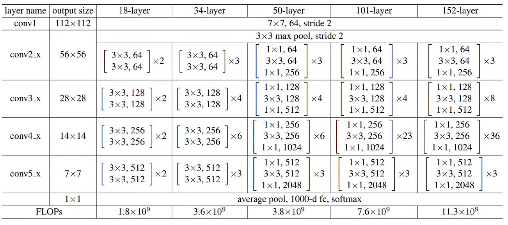

# ResNet Classification in Pytorch
<b>[ResNet](https://arxiv.org/abs/1512.03385): Deep Residual Learning for Image Recognition</b>



***
## Introduction
This is a pytorch implementation of ResNet for image classification by [JeasunLok](https://github.com/JeasunLok). If it is useful for you, please give me a star!

Besides, this is the repository of the <b>Section V.</b> of open course for "starting deep learning" of <b>IMARS, School of Geography and Planning, Sun Yat-Sen University</b>. For this open course, this repository aims at completing <b>scene classification of Remote Sensing images.</b>

Here is the video of how to use this repository in Chinese.
***

## Installation
Create the environment and install the requirements.
```
git clone https://github.com/JeasunLok/ResNet-pytorch.git
conda create -n resnet python=3.9
conda activate resnet
pip install -r requirements.txt
```
If you want to use GPU, please check your CUDA version and download the proper version of [pytorch](https://pytorch.org/get-started/locally/). Use CUDA 12.1 as example:
```
nvidia-smi
pip3 install torch torchvision torchaudio --index-url https://download.pytorch.org/whl/cu121
```
***

## Download and set the Dataset
#### Dataset CIFAR-10
The file ```cifar-10_unpack.py``` provides the method of downloading cifar-10 dataset. So please run this file <b>(maybe you should change the path and make sure it is correct)</b> to get the cifar-10 dataset in ```dataset``` folder. Besides, this file will split the dataset automatically.

#### Dataset SIRI-WHU
Please download the dataset SIRI-WHU in http://www.lmars.whu.edu.cn/prof_web/zhongyanfei/e-code.html and place it in ```dataset``` folder of the repository.

Then run the ```dataset_split.py``` file to split the dataset into train, validate and test set with a proper ratio (3 ratio can be set in the file). <b>You should change the parameter</b> ```input folder``` <b>With your dataset SIRI-WHU downloading path</b>.

<b><font color='red'>Attention</font></b>: pond 0002.tif is wrong and please delete it or replace it with a corret image with shape (200, 200, 3) or you can change the set the parameter ```IsResize=True``` of <b>image_transform</b> in main.
***

## How to use it
1. When the dataset is perpared and split correctly, you should revise the file ```dataset/cls_classes.txt``` with all classes of the dataset (cifar-10 and SIRI-WHU are both provided).
2. Place the ```train```, ```val``` and ```test``` folder with images under ```images``` folder.
3. Run the file of ```dataset_create.py``` to generate the train, validate and test list of your dataset under ```images``` folder. After that, you can see ```cls_train.txt```, ```cls_val.txt``` and ```cls_test.txt``` under ```images``` folder.
4. Revise and define your settings in ```main.py```, all the settings can be revised in this file, including epoch, lr, batch size and so on. One thing should be noted that the ```input_shape``` parameter in main.py should be the same as the size of the images in the dataset.
5. Run the file of ```main.py``` to train, validate and test your model.
***

## License
The repository is licensed under the Apache 2.0 license.
***